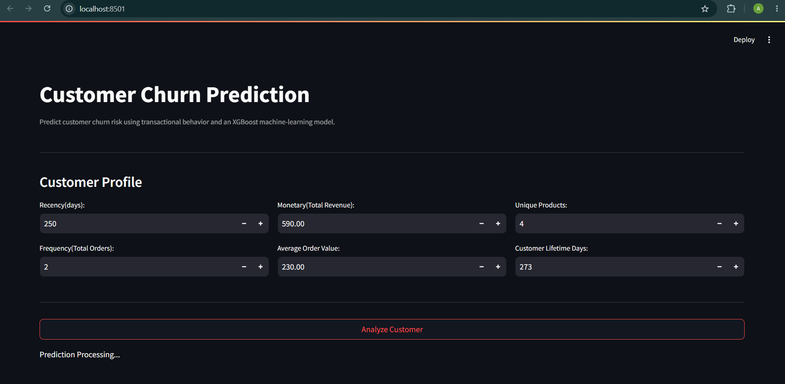
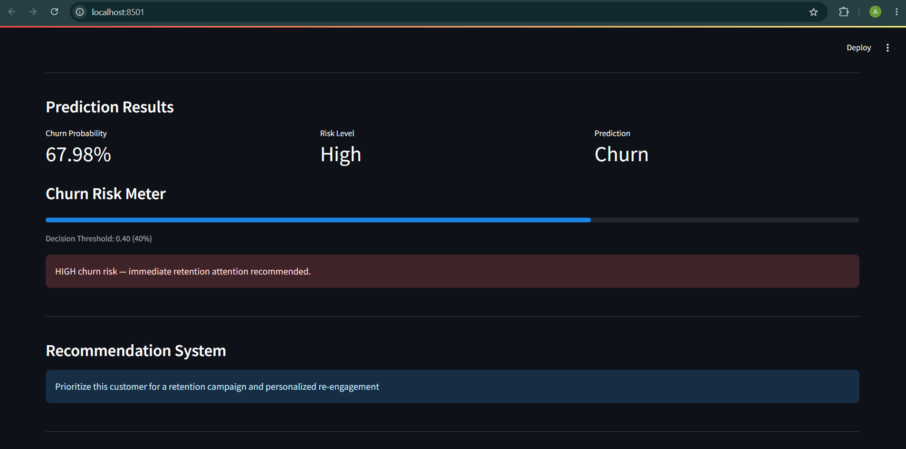
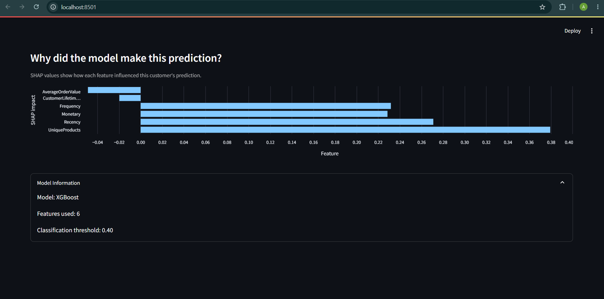

# 🛒 Customer Churn Prediction System

An end-to-end **machine learning system for predicting customer churn from transactional purchasing behavior**, with explainable predictions using **SHAP**.

The project takes customer data from raw transactional behavior through **SQL-based feature engineering, machine learning, explainability, REST API serving, Streamlit visualization, Docker containerization, and cloud deployment**.

## 🌐 Live Application

### 🎨 Streamlit Dashboard

**[Launch the Customer Churn Prediction App](https://retail-churn-frontend.onrender.com)**

### ⚡ FastAPI Backend

**[Open FastAPI Backend](https://customer-churn-api-xhre.onrender.com)**

### 📚 Interactive API Documentation

**[Open Swagger API Documentation](https://customer-churn-api-xhre.onrender.com/docs)**

The complete system is deployed and publicly accessible.

---

## 🎯 Problem Statement

Customer churn is a major business problem in e-commerce.

The goal of this project is to identify customers who are at higher risk of churning so that businesses can prioritize retention and re-engagement efforts.

Instead of producing only a binary prediction, the system provides:

* **Churn probability**
* **Risk classification**
* **Recommended business action**
* **Customer-specific SHAP explanation**

---

## 🏗️ System Architecture

### Local Architecture

```text
                 Transactional Data
                        │
                        ▼
                SQL Data Preparation
                        │
                        ▼
             Customer Feature Engineering
                        │
                        ▼
                  Feature Selection
                        │
                        ▼
                  XGBoost Model
                        │
                 ┌──────┴──────┐
                 ▼             ▼
          Churn Probability   SHAP
                 │             │
                 └──────┬──────┘
                        ▼
                    FastAPI
                        │
                        ▼
                   Streamlit
                        │
                        ▼
                 Docker Compose
```

### ☁️ Production Deployment

```text
                       User
                        │
                        ▼
              ┌──────────────────┐
              │    Streamlit     │
              │    Frontend      │
              │     Render       │
              └────────┬─────────┘
                       │
                       │ HTTP POST /predict
                       ▼
              ┌──────────────────┐
              │     FastAPI      │
              │     Backend      │
              │     Render       │
              └────────┬─────────┘
                       │
                       ▼
              ┌──────────────────┐
              │     XGBoost      │
              │      Model       │
              └────────┬─────────┘
                       │
                       ▼
              ┌──────────────────┐
              │       SHAP       │
              │  Explainability  │
              └────────┬─────────┘
                       │
                       ▼
             Prediction + Explanation
                       │
                       ▼
                  Streamlit UI
```

---

## 🧠 Features

The final model uses six customer-level behavioral features:

| Feature                  | Description                              |
| ------------------------ | ---------------------------------------- |
| **Recency**              | Days since the customer's last purchase  |
| **Frequency**            | Number of distinct orders                |
| **Monetary**             | Total customer revenue                   |
| **AverageOrderValue**    | Average monetary value per order         |
| **UniqueProducts**       | Number of distinct products purchased    |
| **CustomerLifetimeDays** | Duration between first and last purchase |

These features capture customer purchasing behavior and provide the model with meaningful signals for identifying potential churn.

---

## 🤖 Machine Learning

The final model uses **XGBoost** for binary churn classification.

Model development included:

* Customer-level feature engineering
* Feature importance analysis
* Feature selection experiments
* Logistic Regression comparison
* XGBoost hyperparameter tuning
* Cross-validation
* Probability threshold analysis
* SHAP explainability

---

## 📊 Model Performance

### Cross-Validation

**Best cross-validation ROC-AUC:**

```text
0.75228
```

### Test Performance

| Metric    |  Score |
| --------- | -----: |
| Accuracy  | 0.6558 |
| Precision | 0.5980 |
| Recall    | 0.6103 |
| F1 Score  | 0.6041 |
| ROC-AUC   | 0.7251 |

Model performance is evaluated using multiple classification metrics rather than accuracy alone because churn detection involves a trade-off between precision and recall.

---

## 🎚️ Threshold Analysis

The model probability threshold was evaluated instead of automatically assuming a threshold of `0.50`.

| Threshold | Precision | Recall |    F1 |
| --------: | --------: | -----: | ----: |
|      0.30 |     0.536 |  0.866 | 0.662 |
|      0.40 |     0.551 |  0.797 | 0.652 |
|      0.45 |     0.580 |  0.734 | 0.648 |
|      0.50 |     0.598 |  0.610 | 0.604 |
|      0.55 |     0.628 |  0.524 | 0.571 |
|      0.60 |     0.665 |  0.431 | 0.523 |
|      0.65 |     0.739 |  0.283 | 0.409 |

The application uses a configurable decision threshold so that prediction behavior can be aligned with the business objective.

The deployed API currently returns the threshold used for each prediction.

---

## 🔍 Explainable AI with SHAP

The application uses **SHAP (SHapley Additive exPlanations)** to explain individual predictions.

For each customer, the system identifies how each feature contributed to the model's prediction.

Example:

```text
Frequency       → reduces predicted churn
UniqueProducts  → increases predicted churn
Recency         → reduces predicted churn
```

The Streamlit dashboard displays these contributions through a SHAP impact visualization.

> **Note:** SHAP values explain the model's contribution of each feature to a prediction. They should not be interpreted as causal effects.

---

## 🚀 FastAPI

The trained model is exposed through a REST API built using **FastAPI**.

### Prediction Endpoint

```http
POST /predict
```

### Example Request

```json
{
  "recency": 9,
  "frequency": 16,
  "monetary": 2000,
  "average_order_value": 125,
  "unique_products": 29,
  "customer_lifetime_days": 67
}
```

### Example Response

```json
{
  "churn_probability": 0.1529,
  "prediction": 0,
  "risk": "Low",
  "threshold": 0.4,
  "recommendation": "...",
  "model": "XGBoost",
  "features_used": 6,
  "shap_explanation": []
}
```

The API returns:

* Churn probability
* Binary prediction
* Risk classification
* Decision threshold
* Business recommendation
* Model information
* Number of features used
* SHAP explanation

### Health Endpoint

```http
GET /health
```

### Production API

**[Open FastAPI Backend](https://customer-churn-api-xhre.onrender.com)**

### Swagger Documentation

**[Open Interactive API Documentation](https://customer-churn-api-xhre.onrender.com/docs)**

---

## 🎨 Streamlit Dashboard

The frontend provides an interactive interface for customer churn prediction.

### Features

* Customer feature input
* Churn probability
* Risk classification
* Prediction result
* Risk meter
* Business recommendation
* SHAP explainability visualization

### 📸 Dashboard Preview







### 🚀 Live Dashboard

**[Launch the Streamlit Application](https://retail-churn-frontend.onrender.com)**

---

## 🐳 Docker

The application is containerized using Docker.

For local development, the system can be run using Docker Compose.

### Local Architecture

```text
Streamlit
    │
    │ HTTP
    ▼
FastAPI
    │
    ▼
XGBoost + SHAP
```

### Docker Image

The FastAPI backend image is available as:

```text
docker.io/aaravsaini2207/retail-churn-api:latest
```

### Run Locally with Docker Compose

Build the containers:

```bash
docker compose build
```

Start the application:

```bash
docker compose up -d
```

### Streamlit

```text
http://localhost:8501
```

### FastAPI Documentation

```text
http://localhost:8000/docs
```

### FastAPI Health Check

```text
http://localhost:8000/health
```

### Stop the Application

```bash
docker compose down
```

---

## ☁️ Cloud Deployment

The application is deployed using **Render** as two separate services.

### Frontend

**Streamlit + Render**

**[Open Live Application](https://retail-churn-frontend.onrender.com)**

### Backend

**FastAPI + Docker + Render**

**[Open Live API](https://customer-churn-api-xhre.onrender.com)**

### API Documentation

**[Open Swagger Docs](https://customer-churn-api-xhre.onrender.com/docs)**

The deployed architecture is:

```text
Streamlit Frontend
       │
       │ HTTP
       ▼
FastAPI Backend
       │
       ▼
XGBoost + SHAP
```

---

## 📁 Project Structure

```text
customer-churn-ml-system/
│
├── App/
│   └── main.py
│
├── Model/
│   ├── churn_threshold.pkl
│   └── churn_xgboost_model.pkl
│
├── images/
│   ├── streamlit_high_risk.png
│   ├── streamlit_high_risk_recommendation.png
│   └── streamlit_high_risk_shap.png
│
├── Dockerfile
├── Dockerfile.streamlit
├── docker-compose.yml
│
├── requirements.txt
├── requirements-streamlit.txt
├── streamlit_app.py
│
├── Retail_Classification.ipynb
├── Retail_Regression.ipynb
├── Retail_Store.ipynb
├── Retail_mind.ipynb
│
└── .gitignore
```

---

## 🛠️ Tech Stack

| Technology         | Purpose                                  |
| ------------------ | ---------------------------------------- |
| **Python**         | Programming language                     |
| **Pandas**         | Data processing                          |
| **NumPy**          | Numerical computation                    |
| **Scikit-learn**   | Machine learning utilities               |
| **XGBoost**        | Churn classification                     |
| **SHAP**           | Model explainability                     |
| **SQL / MySQL**    | Data preparation and feature engineering |
| **FastAPI**        | REST API                                 |
| **Streamlit**      | Interactive frontend                     |
| **Docker**         | Containerization                         |
| **Docker Compose** | Local multi-container orchestration      |
| **Render**         | Cloud deployment                         |
| **Git / GitHub**   | Version control                          |

---

## 🔄 End-to-End Workflow

```text
Raw Transactions
       ↓
SQL Cleaning
       ↓
Customer-Level Aggregation
       ↓
RFM + Behavioral Features
       ↓
Feature Selection
       ↓
Model Training
       ↓
XGBoost
       ↓
Threshold Optimization
       ↓
SHAP Explainability
       ↓
FastAPI
       ↓
Docker
       ↓
Render
       ↓
Streamlit
       ↓
End User
```

---

## 🔮 Future Improvements

Potential future improvements include:

* Automated model retraining
* Model monitoring
* Data drift detection
* Authentication and authorization for the API
* CI/CD pipeline
* Database-backed prediction history
* Automated retention campaign integration
* Improved model calibration
* Experiment tracking
* Production monitoring and logging

---

## 👨‍💻 Author

### Aarav Saini

**B.Tech — Computer Science Engineering**

GitHub: **[aaravsaini2207-dev](https://github.com/aaravsaini2207-dev)**

---

## ⭐ Project Goal

The objective of this project was not only to train a churn classification model, but to build a **complete machine learning application around it**.

The project demonstrates the complete journey from:

```text
Data Preparation
      ↓
Feature Engineering
      ↓
Machine Learning
      ↓
Model Evaluation
      ↓
Threshold Optimization
      ↓
SHAP Explainability
      ↓
REST API
      ↓
Docker
      ↓
Cloud Deployment
      ↓
Interactive Web Application
```

This makes the project a practical example of taking a machine learning model from experimentation to a **deployed, explainable, end-to-end ML application**.

---

⭐ **If you found this project useful, consider giving the repository a star!**
