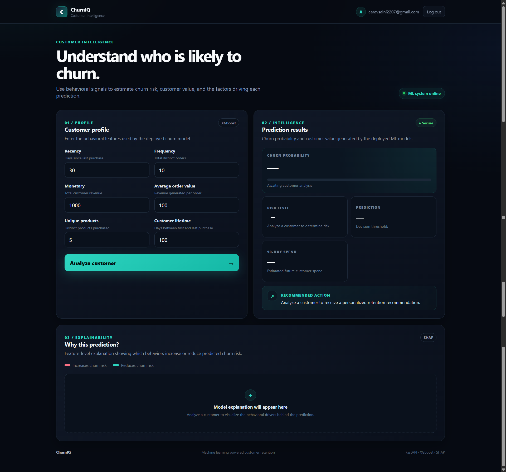
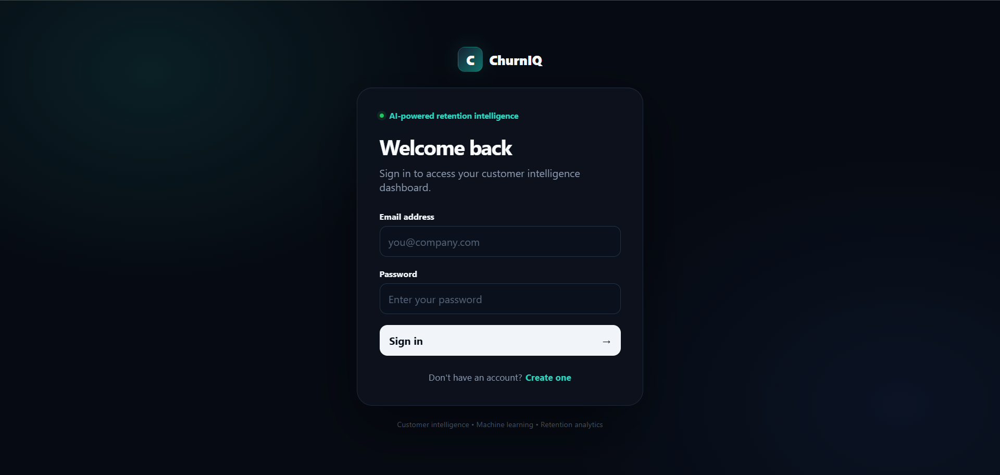
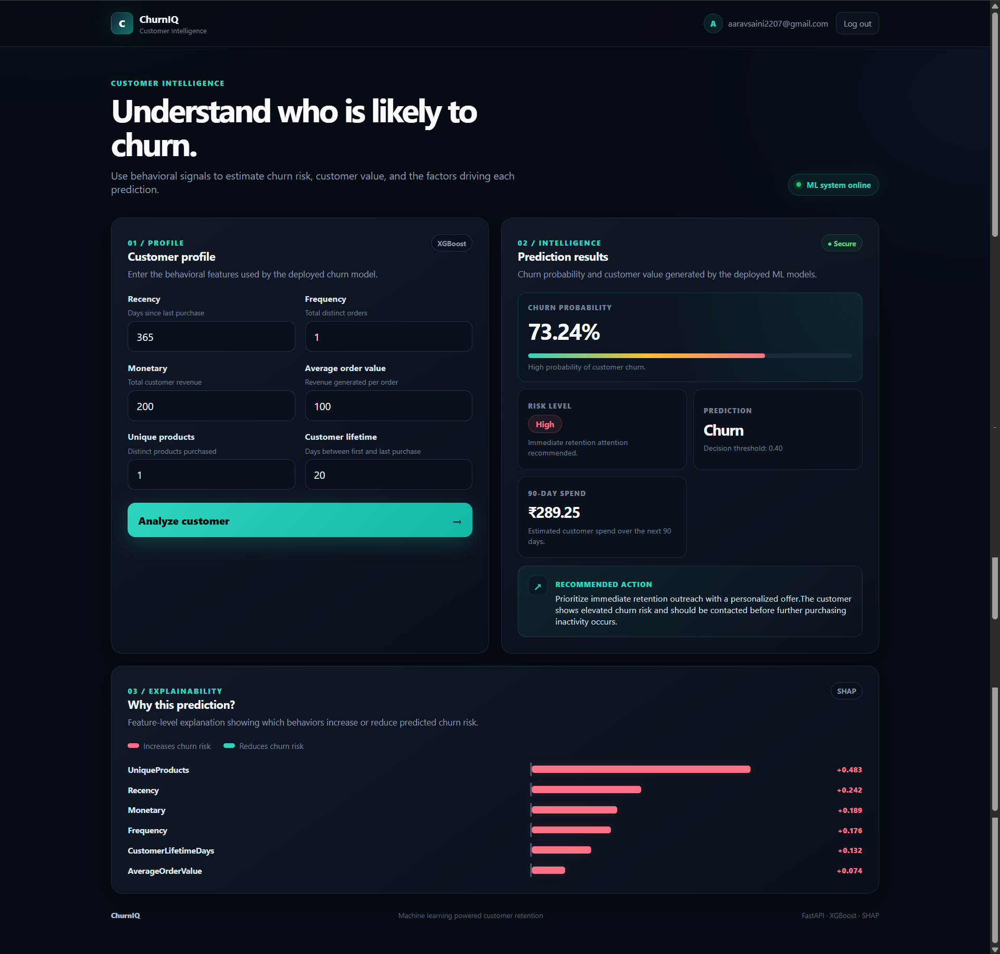
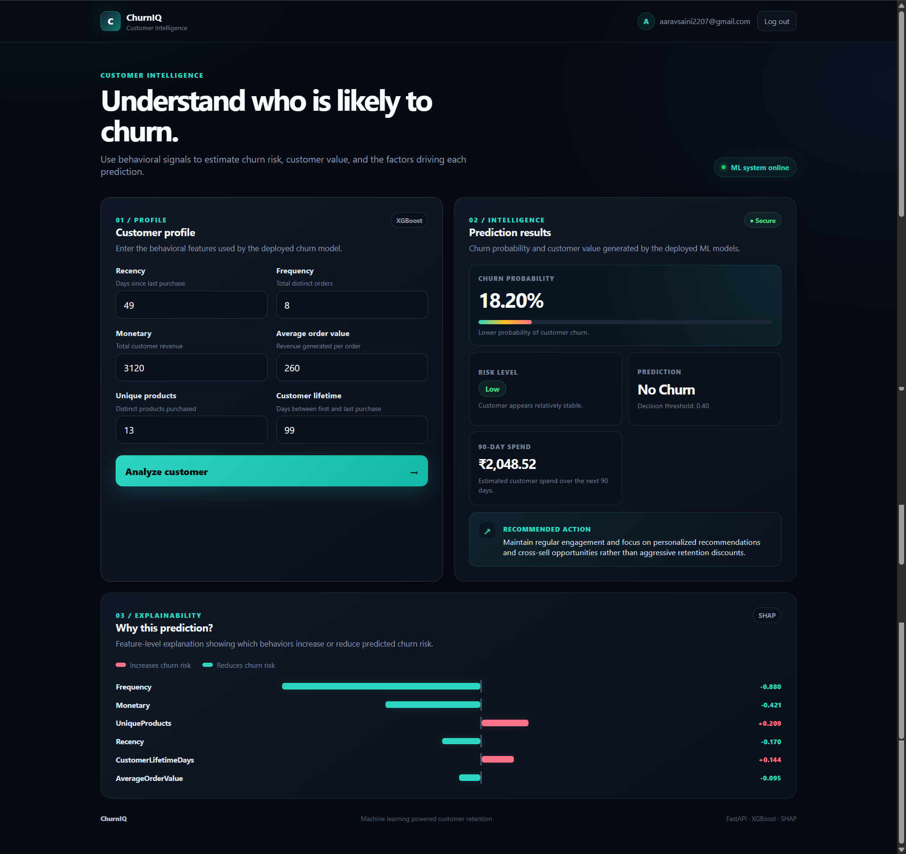

# Customer Churn Intelligence

End-to-end ML system for **customer churn prediction, 90-day spend forecasting, SHAP explainability, authentication, and persistent predictions**.

**XGBoost + SHAP + FastAPI + PostgreSQL + Firebase + Docker**



## At a glance

| Capability | Implementation |
|---|---|
| Churn prediction | XGBoost classifier |
| 90-day spend | Random Forest regressor |
| Explainability | SHAP TreeExplainer |
| Risk tiers | Low / Medium / High |
| Authentication | Firebase Auth + ID-token verification |
| API | FastAPI + Pydantic |
| Database | PostgreSQL + SQLAlchemy |
| Migrations | Alembic |
| Frontend | HTML / CSS / JavaScript |
| Deployment | Docker / Render |
| Testing | pytest + GitHub Actions |

## ML results

Six customer-behaviour features are used: **Recency, Frequency, Monetary Value, Average Order Value, Unique Products, Customer Lifetime Days**.

| Metric | Result |
|---|---:|
| Cross-validation ROC-AUC | **0.7523** |
| Test ROC-AUC | **0.7251** |
| Test accuracy | **65.58%** |
| Test precision | **59.80%** |

These are offline evaluation results, not production performance claims.

The spend model predicts expected customer spend over the next 90 days. Regression metrics are intentionally omitted until the training notebook is the verified source of truth.

## Architecture

```text
Web Dashboard
      │
Firebase Authentication
      │ ID Token
      ▼
   FastAPI
      │
 ┌────┼───────────────┐
 ▼    ▼               ▼
XGBoost  Random Forest  SHAP
Churn    90-Day Spend   Explanation
 └────┼───────────────┘
      ▼
 PostgreSQL
Users + Predictions
```

The main customer-intelligence endpoint combines **churn prediction + spend forecasting + SHAP explanations + database persistence**.

## Screenshots







## API

```text
GET  /api/v1/health
POST /api/v1/predict
POST /api/v1/predict_spend
POST /api/v1/customer-intelligence
GET  /users/me
POST /users/
POST /users/login
```

Swagger: `/docs`

## Security

- Email/password registration and verification
- Google sign-in
- Firebase ID-token verification
- Protected prediction endpoints
- Firebase UID → application-user mapping
- PostgreSQL-backed users and predictions
- Firebase credentials supplied through environment variables

## Run locally

```bash
git clone https://github.com/aaravsaini2207-dev/customer-churn-ml-system.git
cd customer-churn-ml-system
cp .env.example .env
docker compose up --build
```

**Local:** Frontend `localhost:8501` · API `localhost:8000` · Swagger `localhost:8000/docs` · PostgreSQL `localhost:2207`

## Tests

```bash
python -m pytest -v
```

GitHub Actions runs the backend test suite on pushes and pull requests to `main`.

## Engineering highlights

- Authenticated ML inference API
- Firebase token verification at the backend boundary
- PostgreSQL prediction persistence
- Alembic schema migrations
- Combined ML + SHAP inference workflow
- Dockerized API, database, and frontend
- Pydantic validation and structured responses

## Limitations

- Offline model evaluation may not generalize to another customer population.
- Production drift monitoring and automated retraining are not implemented.
- Retention recommendations are rule-based rather than learned from treatment outcomes.

## Future work

Model monitoring · automated retraining · batch prediction · customer segmentation · experiment-driven retention recommendations

**Aarav Saini** · Machine Learning · Data Science · Backend Engineering · Explainable AI
